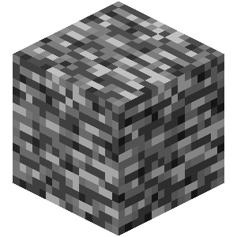
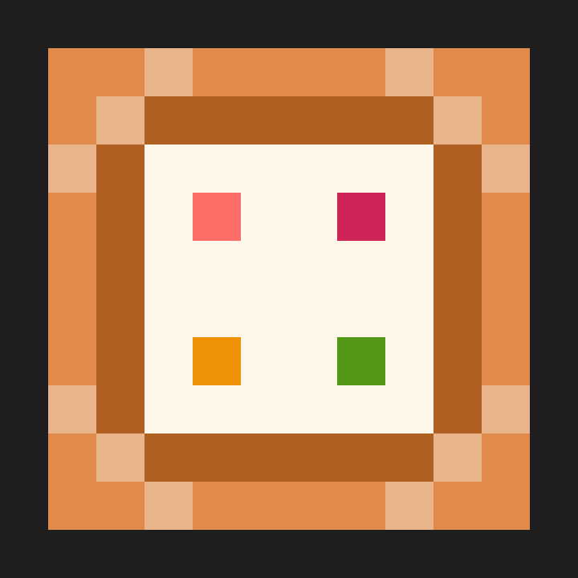
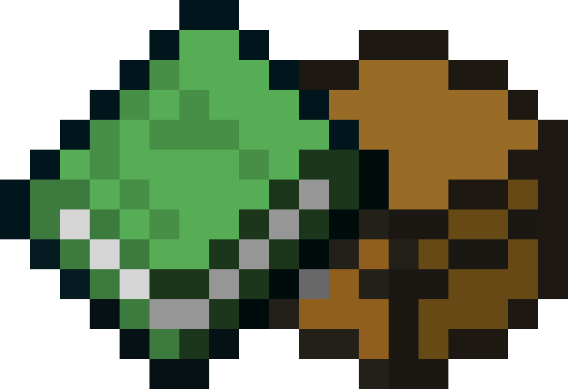
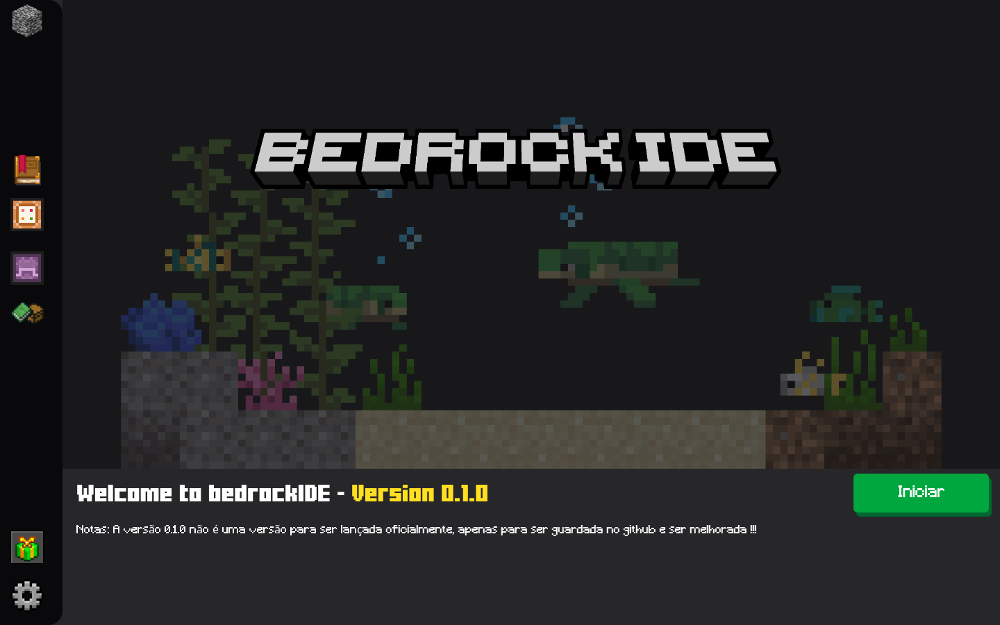

# Bedrock IDE
movido pela pela motivação de construir uma IDE, decidi desenvolver uma para ajudar os iniciantes na scriptização do minecraft bedrock
## apresentação da IDE
essa IDE possui algumas partes, sendo elas:
 
 - O icone do app, leva direto para este github ao clicar
 
 
 - icone que se refere a pagina inicial, nela possui a tela de boas vindas e algumas informações
 
 
 - esse icone se refere ao editor, ainda pretendo ver se usarei o botão de iniciar ou se deixarei esse icone.
 
 
 - esse icone levará você para a documentação explicando a construção dos scripts
 
 
 - ao clicar nesse icone, você será levado a uma pagina de agradecimentos e um menu especial, entre para ver ;)
 
 
 - configure a IDE pelo menu de configurações
 
## Imagens da IDE

